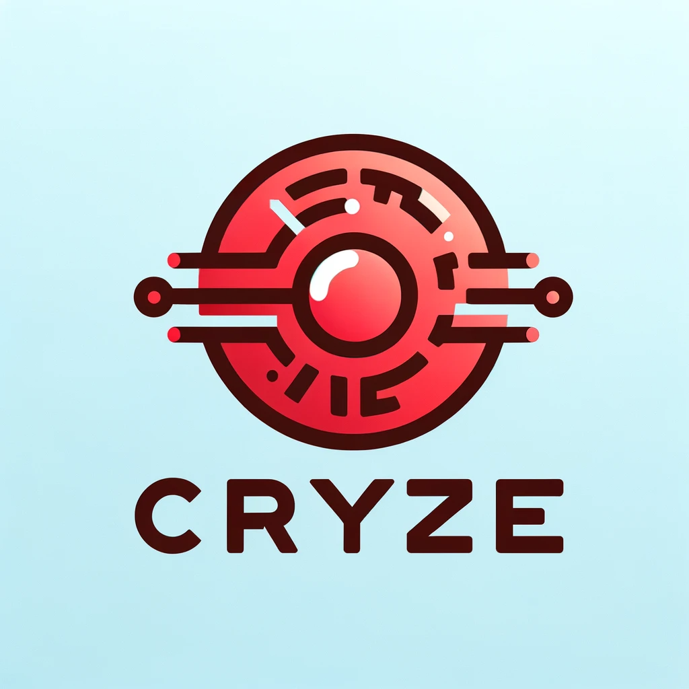

# Cryze
Cryze is a Wyze Gwell Camera Bridge that allows you to stream your Gwell based Wyze cams to locations of your choosing.

## What is Cryze?
Cryze is an open-source project dedicated to providing you access to your own video camera data from Gwell-based Wyze cameras. I believe in giving you control over your camera footage without any restrictions.

Huge shoutout to [mrlt8/docker-wyze-bridge](https://github.com/mrlt8/docker-wyze-bridge) for putting in tremendous work implementing numerous Wyze Cam features and streaming capabilities.

# Getting Started
## Prerequisites
Before diving into the world of Cryze, you'll need a few things:

- A Gwell-based Wyze camera that you want video access to
- A server or device to host Cryze.

## Contribute
Cryze is an open-source project, and we welcome contributions from the community. Whether you're a developer, designer, or just an enthusiastic user, there are many ways to get involved. Check out our contribution guidelines to see how you can help make Cryze even better.

## Support
If you run into any issues or have questions about using Cryze, don't hesitate to reach out to our community forum. We're here to help!

## License
Cryze is released under the GPLv3 License, which means it's free to use and modify as long as you keep it open source and public, see LISCENSE for more info. We encourage you to customize Cryze to suit your needs.

## Disclaimer
Please note that using Cryze may void your Wyze camera's warranty, and it may not be legal in some regions. Be sure to check your local laws and the terms of service for your Wyze camera before using Cryze.

With that, start enjoying the freedom to access your Wyze camera data with Cryze! 🎉📷